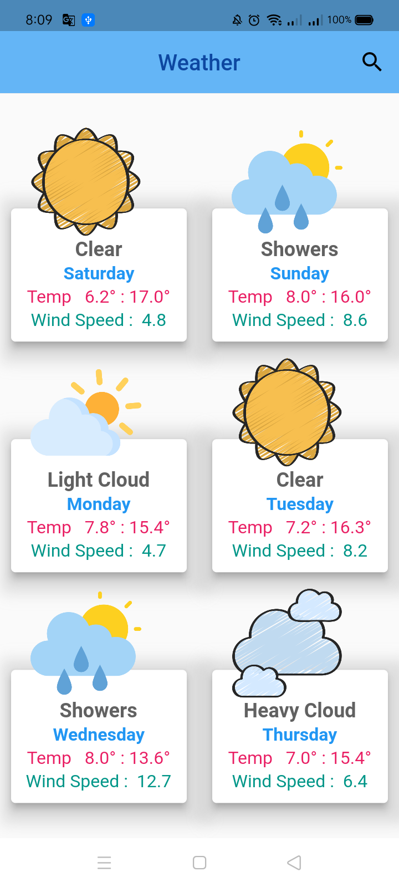
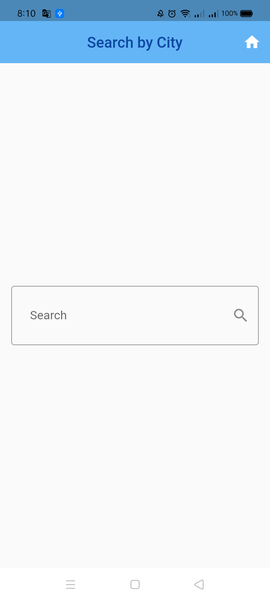
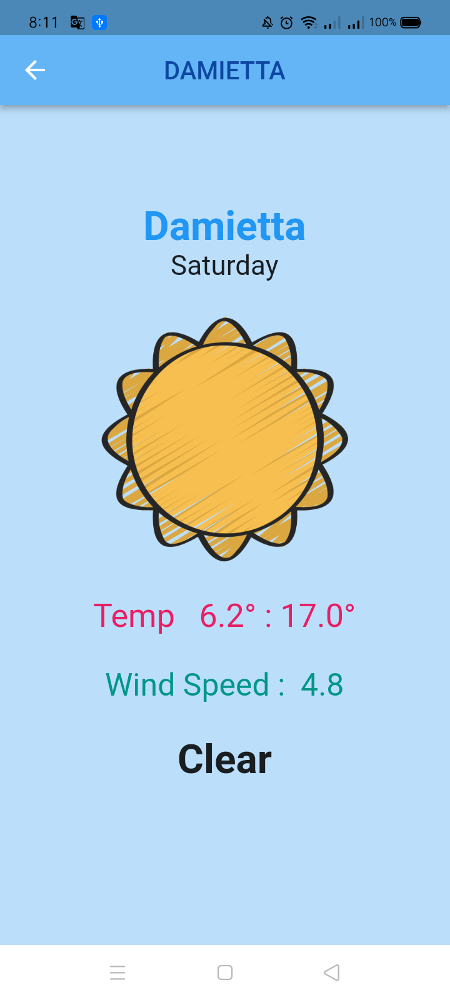

  
# Weather App

Weather information at your current location and give
You site all the time
Six-day forecast
And search for any city you want

Apis : https://www.metaweather.com/api/

## Methods

- [Location Search](https://www.metaweather.com/api/#locationsearch)

  Find a location

- [Location](https://www.metaweather.com/api/#location)

  Location information, and a 5 day forecast

- [Location Day](https://www.metaweather.com/api/#locationday)

  Source information and forecast history for a particular day & location

  

  
# Package

## geolocator :   A Flutter geolocation plugin which provides easy access to platform specific location services

## http : A composable, Future-based library for making HTTP requests

## intl : Provides internationalization and localization facilities, including message translation, plurals and genders, date/number formatting and parsing, and bidirectional text.

## provider : A wrapper around InheritedWidget to make them easier to use and more reusable.

### 
